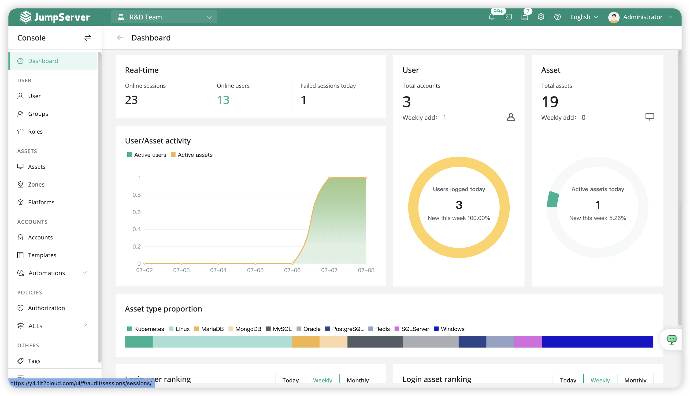

# JumpServer
Introduction to JumpServer system and configuration instructions

- Introduction
- Architecture Overview
- Environment Preparation
- Installing JumpServer
- Basic Configuration
- Testing the System
- Troubleshooting
- References
## Architecture Overview
This diagram shows the basic JumpServer architecture and how components interact.

## Console View
Below is an example of a session running inside JumpServer.

