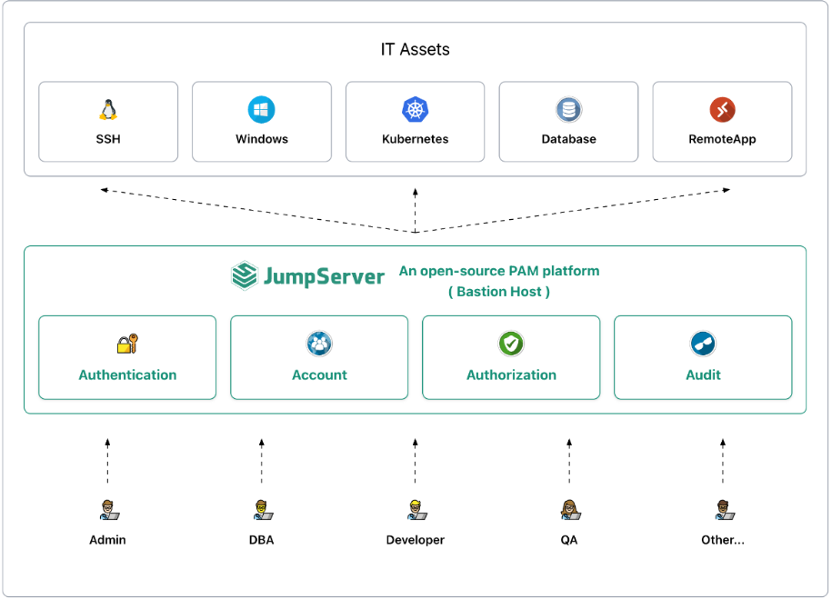

# 🚀 JumpServer Installation & Configuration Guide

JumpServer is an open-source **Privileged Access Management (PAM)** system that helps manage privileged accounts, record user sessions, and control activities on servers, databases, and network devices.

> **Goals:**  
> - Understand JumpServer architecture.  
> - Install and configure the system end-to-end.  
> - Create assets, accounts, and verify successful connections.

---

## 📚 Table of Contents
1. [Introduction](docs/introduction.md)
2. [Architecture Overview](docs/architecture.md)
3. [Environment Preparation](docs/environment-preparation.md)
4. [Installing JumpServer](docs/installing-jumpserver.md)
5. [Testing the System](docs/testing-system.md)
6. [Troubleshooting](docs/troubleshooting.md)
7. [References](docs/references.md)

---

## Deployment Architecture Diagram
Below is a deployment architecture diagram.

## Console View
Below is an example of a session running inside JumpServer.

------
