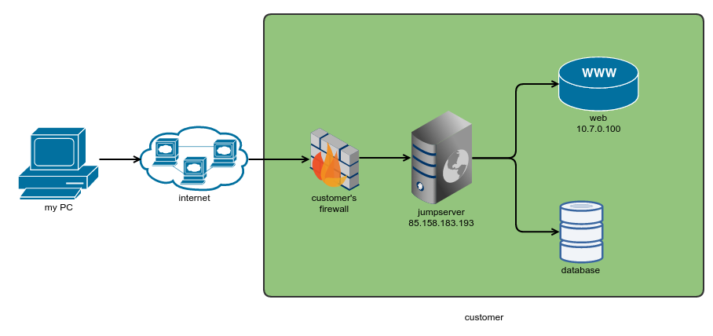

# Architecture Overview

JumpServer consists of several core components:

| Component     | Description                                |
|---------------|--------------------------------------------|
| **Core**      | The main management and control center.    |
| **Koko**      | Proxy for handling SSH and RDP traffic.    |
| **Guacamole** | Web gateway for RDP and VNC connections.   |
| **Web**       | User interface for admins and users.       |
| **Luna**      | Session recording and storage.             |

## Diagram
Below is a simplified architecture diagram showing how components interact.

