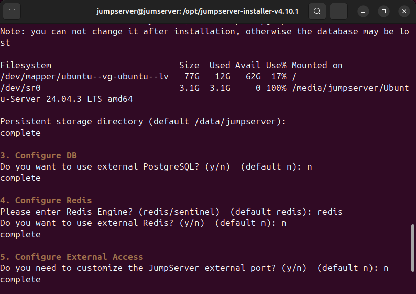
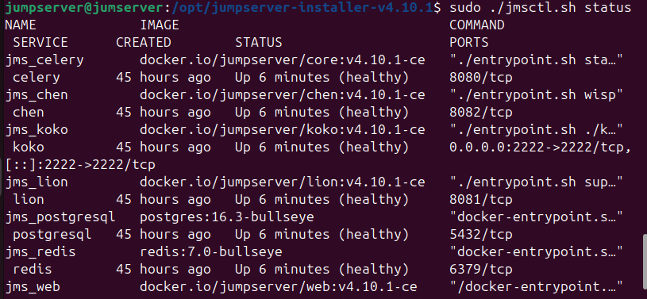

# Install JumpServer

This page helps you installing JumpServer.

> **Goal:** Have a clean OS, a clear network plan (IPs, ports), Docker/Compose installed, and working SSH/RDP access to your target assets.

---

## 1) Install System (JumpServer Host)

**Install and unzip JumpServer:**
```bash
cd /opt
sudo wget https://github.com/jumpserver/installer/releases/download/v4.10.1/jumpserver-installer-v4.10.1.tar.gz
sudo tar -xzf jumpserver-installer-v4.10.1.tar.gz
cd jumpserver-installer-v4.10.1
```

**Run file jumpserver-installer-v4.10.1**
```
sudo ./jmsctl.sh install 
```

**During installation, select the following:**
Persistent directory: y → /data/jumpserver(create directory if not exist: sudo mkdir -p /data/jumpserver).
Using external PostgreSQL? → n (use built-in).
Select Redis Engine? → enter "redis".
Customize external port? → n (use default port 80).



**System startup**
```bash
sudo ./jmsctl.sh start
```

**If you get an error that port 80 is already in use, check the service occupying the port:**
If you get an error that port 80 is already in use, check the service occupying the port:
```bash
sudo lsof -i :80
sudo systemctl stop apache2
```
Then run again:
```bash
sudo ./jmsctl.sh start
```

**Check container status**
```bash
sudo ./jmsctl.sh status
```


**Access the Web UI interface using jumpserver host to test**
ip: http://127.0.0.1
deauft account:
username: admin
password: ChangeMe
**Note: The system requires you to change your password immediately after the first login.**

## 4) Config (Linux WebService)

**Install SSH service**
```bash
sudo apt update
sudo apt install openssh-server -y
sudo systemctl enable ssh
sudo systemctl start ssh
```


**Configure firewall (UFW)**
We open ports for SSH and HTTP:
```bash
sudo ufw allow sshS 
sudo ufw allow http 
sudo ufw enable
```


