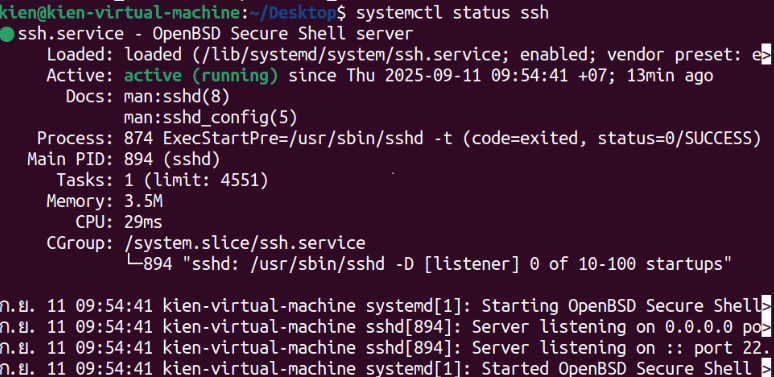

# Install JumpServer

This page helps you installing JumpServer.

> **Goal:** Have a clean OS, a clear network plan (IPs, ports), Docker/Compose installed, and working SSH/RDP access to your target assets.

---

## 1) Install System (JumpServer Host)

**Install and unzip JumpServer:**
```bash
cd /opt
sudo wget https://github.com/jumpserver/installer/releases/download/v4.10.1/jumpserver-installer-v4.10.1.tar.gz
sudo tar -xzf jumpserver-installer-v4.10.1.tar.gz
cd jumpserver-installer-v4.10.1
```

**Run file jumpserver-installer-v4.10.1**
```
sudo ./jmsctl.sh install 
```

**During installation, select the following:**
- Persistent directory: y → /data/jumpserver(create directory if not exist: sudo mkdir -p /data/jumpserver).
- Using external PostgreSQL? → n (use built-in).
- Select Redis Engine? → enter "redis".
- Customize external port? → n (use default port 80).


**System startup**
```bash
sudo ./jmsctl.sh start
```

**If you get an error that port 80 is already in use, check the service occupying the port:**
If you get an error that port 80 is already in use, check the service occupying the port:
```bash
sudo lsof -i :80
sudo systemctl stop apache2
```
Then run again:
```bash
sudo ./jmsctl.sh start
```

**Check container status**
```bash
sudo ./jmsctl.sh status
```


**Access the Web UI interface using jumpserver host to test**
- ip: http://127.0.0.1
- deauft account:
- username: admin
- password: ChangeMe
- **Note: The system requires you to change your password immediately after the first login.**

## 4) Config (Linux WebService)

**Install SSH service**
```bash
sudo apt update
sudo apt install openssh-server -y
sudo systemctl enable ssh
sudo systemctl start ssh
```


**Configure firewall (UFW)**
We open ports for SSH and HTTP:
```bash
sudo ufw allow sshS 
sudo ufw allow http 
sudo ufw enable
```


**Deploy test web application**
To verify the web service is working, install Nginx and create a basic HTML page:
```bash
sudo apt install nginx -y 
echo "<h1>Web Service - Ubuntu Server</h1>" | sudo tee /var/www/html/index.html 
sudo systemctl enable nginx 
sudo systemctl start nginx
```
- Once deployed, Nginx will listen on port 80.
- Going to http://192.168.214.140/ in a browser will display a test message

 ## 5) Config Windows Server(File service)
- Objective: Deploy Windows Server B to provide File Service and Remote Desktop Protocol (RDP) to users in the system. All access is configured to go through JumpServer only, to ensure control, monitoring and enhance the security of the system.
- Implementation content:
   Enable and enable Remote Desktop (RDP) service on port TCP/3389.
   Create and manage local user accounts, assign permissions by role.
   Set up shared folders, apply detailed permission policies for each user.
   Configure firewall (Windows Firewall) to only allow JumpServer to access RDP and SMB (TCP/445) services.
   Perform testing to confirm that the system operates correctly as required and ensures security.

**Enable Remote Desktop (RDP)**
- Open Server Manager → Local Server → find Remote Desktop → select Enable.
- In the System Properties window, select Allow remote connections to this computer.
- By default, the RDP service will listen on TCP port 3389.

- Open Services.msc → make sure Remote Desktop Services is in Running state.
→ The server is ready for remote connection via JumpServer.


**Create a local user account (Standalone – Local Users)**
- Go to Computer Management → Local Users and Groups → Users → New User…
- For example, create 3 accounts: tester, dev, admin.

- Add tester and dev to the Remote Desktop Users group to allow RDP login.

- Add admin to Administrators group to have full administrative rights


**Create a Shared Folder**
- Create folder: Open File Explorer → drive C: → create folder "SharedFolder".
- Right click → Properties → Sharing tab → Select Advanced Sharing → tick Share this folder.

- Select Permissions to assign permissions:
Delete the default Everyone permission (if any).
Add users and assign permissions one by one:
tester → tick Read.
dev → tick Change (equivalent to Read/Write).
admin → tick Full Control.
- Click OK to save.


- Configure NTFS Permission (required)
- In the Properties window → switch to the Security tab.
- Click Edit → Add → to add tester, dev, admin.

- **Tester → only tick Read & execute, List folder contents, Read.**
- **Dev → tick Modify and Write (equivalent to Read/Write).**
- **Admin → tick Full Control.**


